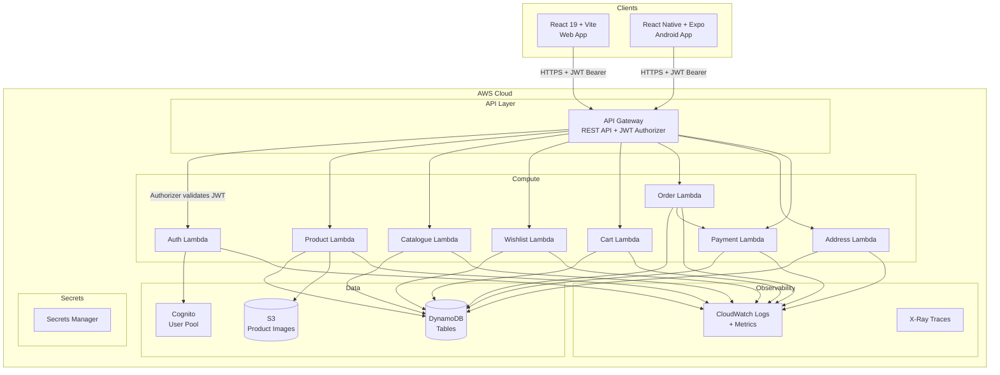
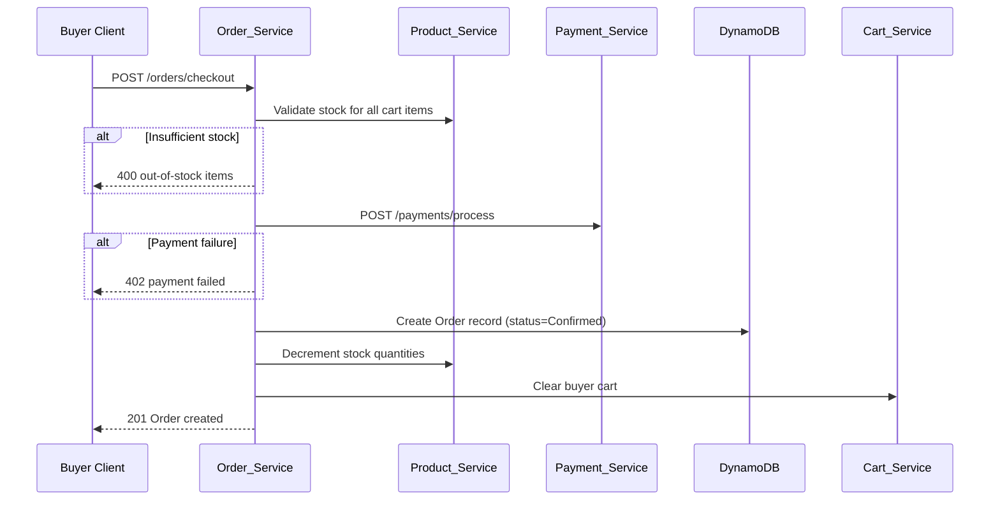
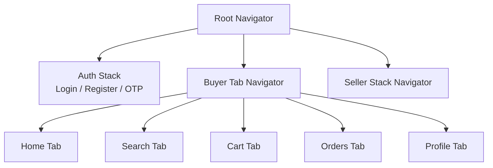
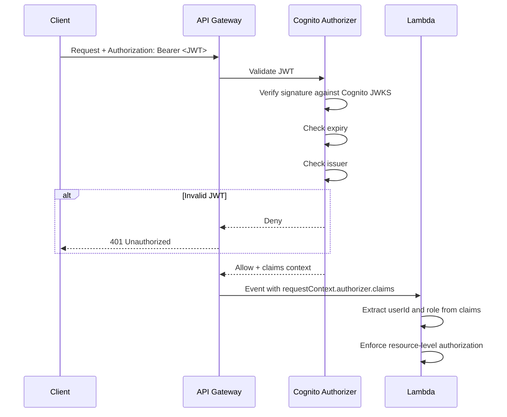

# Design Document — BlipZo Shopping Platform

## Overview

BlipZo is a cloud-native e-commerce platform supporting Buyers and Sellers across Android (primary), Web (secondary), and iOS (future). The system is built on AWS Serverless infrastructure using a Turborepo monorepo, with eight independent backend microservices exposed through a single API Gateway. Mock implementations cover OTP delivery and payment processing to fit the academic project scope.

### Design Goals

- **Serverless-first**: All compute runs on AWS Lambda; no servers to manage.
- **Access-pattern-first data**: DynamoDB tables are designed around query patterns, not entity relationships.
- **Shared contracts**: A `packages/shared` package provides TypeScript types and Zod schemas consumed by all apps and services.
- **Environment isolation**: Dev, QA, and Production are fully independent AWS deployments.
- **Security by default**: JWT validation at the API Gateway layer; least-privilege IAM for every Lambda.

---

## Architecture

### High-Level System Diagram



### Monorepo Structure

```
blipzo/
├── apps/
│   ├── web/                    # React 19 + Vite web application
│   └── mobile/                 # React Native + Expo Android app
├── packages/
│   └── shared/                 # Shared TypeScript types, Zod schemas, API contracts
├── services/
│   ├── auth-service/           # Auth_Service Lambda handlers
│   ├── product-service/        # Product_Service Lambda handlers
│   ├── catalogue-service/      # Catalogue_Service Lambda handlers
│   ├── wishlist-service/       # Wishlist_Service Lambda handlers
│   ├── cart-service/           # Cart_Service Lambda handlers
│   ├── order-service/          # Order_Service Lambda handlers
│   ├── address-service/        # Address_Service Lambda handlers
│   └── payment-service/        # Payment_Service Lambda handlers (mock)
├── infra/
│   └── cdk/                    # AWS CDK TypeScript stacks
├── .github/
│   └── workflows/              # GitHub Actions CI/CD pipelines
├── turbo.json                  # Turborepo pipeline configuration
└── pnpm-workspace.yaml         # pnpm workspace configuration
```

### Request Flow

```
Client → API Gateway (HTTPS)
       → JWT Authorizer Lambda (validates signature, expiry, role)
       → Route-matched Lambda (business logic via Middy middleware)
       → DynamoDB / S3 / Cognito
       → Structured JSON response
```

All Lambda handlers follow the thin-handler pattern: the handler function only parses the event and delegates to a service layer. Business logic lives in service modules, not in the handler.

---

## Components and Interfaces

### Lambda Handler Pattern

Every service Lambda follows this structure:

```typescript
// handler.ts — thin handler, delegates to service
import middy from '@middy/core';
import httpJsonBodyParser from '@middy/http-json-body-parser';
import httpErrorHandler from '@middy/http-error-handler';
import { correlationIds } from '@middy/correlation-ids';
import { APIGatewayProxyEvent, APIGatewayProxyResult } from 'aws-lambda';
import { serviceFunction } from './service';
import { validateInput } from './validators';

const rawHandler = async (event: APIGatewayProxyEvent): Promise<APIGatewayProxyResult> => {
  const input = validateInput(event);
  const result = await serviceFunction(input);
  return { statusCode: 200, body: JSON.stringify(result) };
};

export const handler = middy(rawHandler)
  .use(httpJsonBodyParser())
  .use(correlationIds({ sampleDebugLogRate: 0.01 }))
  .use(httpErrorHandler());
```

### Middy Middleware Stack (all services)

| Middleware | Purpose |
|---|---|
| `http-json-body-parser` | Parse JSON request body |
| `correlation-ids` | Inject/propagate correlation ID |
| `http-error-handler` | Standardize error responses |
| Custom auth middleware | Extract and validate JWT claims |
| Custom logger middleware | Emit structured JSON logs to CloudWatch |

### Auth_Service

**Responsibilities**: User registration, email/password login, phone/OTP login, JWT issuance, refresh token management.

**AWS Resources**: Cognito User Pool, OTP DynamoDB table.

**Key interfaces**:

```typescript
interface RegisterRequest {
  email?: string;
  phone?: string;       // E.164 format
  password: string;
  role: 'Buyer' | 'Seller';
}

interface LoginRequest {
  email: string;
  password: string;
}

interface OtpRequestPayload {
  phone: string;        // E.164 format
}

interface OtpVerifyPayload {
  phone: string;
  otp: string;          // 6-digit numeric
}

interface AuthResponse {
  accessToken: string;  // JWT, ≤60 min expiry
  refreshToken: string; // ≤7 days expiry
  userId: string;
  role: 'Buyer' | 'Seller';
}
```

**JWT Claims Structure**:

```json
{
  "sub": "<userId>",
  "role": "Buyer | Seller",
  "iat": 1700000000,
  "exp": 1700003600,
  "iss": "blipzo-auth"
}
```

**OTP Flow**:
1. Client sends phone number → Auth_Service generates 6-digit OTP, stores in OTP table with 10-min TTL, triggers mock delivery (logs OTP to CloudWatch in dev/qa only).
2. Client sends phone + OTP → Auth_Service validates OTP (not expired, not used, attempt count < 3), marks OTP as used, returns JWT.

**Account Lockout**:
- Failed attempt counter stored in Cognito custom attribute `custom:failedAttempts` and `custom:lockUntil`.
- After 5 failures within 15 minutes, `custom:lockUntil` is set to `now + 15 min`.
- Every login attempt checks `custom:lockUntil` before proceeding.

### Product_Service

**Responsibilities**: Product CRUD, S3 image upload, Seller_Policy management.

**AWS Resources**: Products DynamoDB table, S3 product-images bucket.

**Key interfaces**:

```typescript
interface CreateProductRequest {
  name: string;           // 1–200 chars
  description: string;    // 1–2000 chars
  price: number;          // >0, ≤9999999.99
  stockQuantity: number;  // 0–999999
  categories: string[];   // at least one
  images: ImageUpload[];  // 1–10 items, each ≤10MB, JPEG/PNG/WebP
}

interface ImageUpload {
  filename: string;
  contentType: 'image/jpeg' | 'image/png' | 'image/webp';
  sizeBytes: number;
}

interface ProductRecord {
  productId: string;
  sellerId: string;
  name: string;
  description: string;
  price: number;
  stockQuantity: number;
  categories: string[];
  imageUrls: string[];    // S3 object URLs
  isDeleted: boolean;
  createdAt: string;      // ISO 8601
  updatedAt: string;
  sellerPolicy?: SellerPolicy;
}

interface SellerPolicy {
  returnWindowDays: number;   // 0–30
  exchangeAllowed: boolean;
  conditions?: string;
  policyVersion: string;      // UUID, for temporal consistency
  createdAt: string;
}
```

**S3 Upload Strategy**: Pre-signed URLs are generated by the Lambda; the client uploads directly to S3. The Lambda records the S3 keys in DynamoDB only after confirming all uploads succeeded. If any upload fails, no DynamoDB record is written.

### Catalogue_Service

**Responsibilities**: Category browsing, product detail retrieval, search.

**AWS Resources**: Products DynamoDB table (read-only), Categories DynamoDB table.

**Key interfaces**:

```typescript
interface CatalogueListRequest {
  categoryId: string;
  limit?: number;         // 1–20, default 20
  cursor?: string;        // base64-encoded DynamoDB LastEvaluatedKey
}

interface CatalogueListResponse {
  items: CatalogueItem[];
  nextCursor?: string;
  total?: number;
}

interface CatalogueItem {
  productId: string;
  name: string;
  price: number;
  primaryImageUrl: string;
  averageRating: number;
  sellerName: string;
}

interface SearchRequest {
  query: string;          // 1–100 non-whitespace-only chars
  limit?: number;
  cursor?: string;
}
```

**Search Implementation**: DynamoDB does not support full-text search natively. For the academic scope, search is implemented using a GSI on a `searchTokens` attribute (space-separated lowercase tokens derived from name + description). A `FilterExpression` with `contains` is applied post-query. For production scale, this would be replaced with OpenSearch.

### Wishlist_Service

**Responsibilities**: Add/remove products from Buyer wishlist, retrieve wishlist with enriched product data.

**Key interfaces**:

```typescript
interface WishlistItem {
  productId: string;
  addedAt: string;
}

interface WishlistResponse {
  buyerId: string;
  items: WishlistItemEnriched[];
  count: number;
}

interface WishlistItemEnriched {
  productId: string;
  name: string;
  price: number;
  primaryImageUrl: string;
  isAvailable: boolean;   // false if product deleted by seller
  addedAt: string;
}
```

### Cart_Service

**Responsibilities**: Add/update/remove cart items, calculate totals, clear cart.

**Key interfaces**:

```typescript
interface CartItem {
  productId: string;
  quantity: number;       // 1–999; 0 triggers removal
}

interface CartResponse {
  buyerId: string;
  items: CartItemEnriched[];
  total: number;          // rounded to 2 decimal places
}

interface CartItemEnriched {
  productId: string;
  name: string;
  price: number;
  primaryImageUrl: string;
  quantity: number;
  subtotal: number;       // price * quantity, rounded to 2 decimal places
}
```

### Order_Service

**Responsibilities**: Checkout, order history, order detail, cancellation, return/exchange requests.

**Key interfaces**:

```typescript
interface CheckoutRequest {
  addressId: string;
  paymentMethod: 'UPI' | 'CreditCard' | 'DebitCard' | 'CashOnDelivery';
  paymentDetails?: MockPaymentDetails;
}

interface OrderRecord {
  orderId: string;
  buyerId: string;
  orderTimestamp: string;
  deliveryAddressSnapshot: AddressSnapshot;
  items: OrderItem[];
  paymentMethod: string;
  paymentStatus: 'Paid' | 'Pending' | 'Refunded' | 'RefundPending';
  orderStatus: 'Confirmed' | 'Processing' | 'Shipped' | 'Delivered' | 'Cancelled';
  totalAmount: number;
  transactionId?: string;
  refundStatus?: 'Pending' | 'Completed';
}

interface OrderItem {
  productId: string;
  name: string;
  quantity: number;
  priceAtPurchase: number;
  subtotal: number;
}

interface ReturnExchangeRequest {
  requestId: string;
  orderId: string;
  buyerId: string;
  type: 'Return' | 'Exchange';
  status: 'Pending' | 'Approved' | 'Rejected';
  sellerNotes?: string;
  policyVersionAtRequest: string;   // snapshot of policy version used for eligibility
  createdAt: string;
}
```

**Checkout Sequence**:



### Address_Service

**Responsibilities**: CRUD for Buyer delivery addresses, default address management.

**Key interfaces**:

```typescript
interface AddressRecord {
  addressId: string;
  buyerId: string;
  fullName: string;       // 1–100 chars
  phone: string;          // E.164
  line1: string;          // 1–200 chars
  line2?: string;
  city: string;           // 1–100 chars
  state: string;          // 1–100 chars
  postalCode: string;
  country: string;
  isDefault: boolean;
  createdAt: string;
  updatedAt: string;
}
```

### Payment_Service (Mock)

**Responsibilities**: Mock payment processing for UPI, Credit Card, Debit Card, and Cash on Delivery.

**Key interfaces**:

```typescript
interface PaymentRequest {
  orderId: string;
  amount: number;
  method: 'UPI' | 'CreditCard' | 'DebitCard' | 'CashOnDelivery';
  mockPayload?: MockPaymentDetails;
}

interface MockPaymentDetails {
  // Mock fields only — no real card numbers or UPI IDs stored
  mockCardLast4?: string;   // display only, not persisted
  mockUpiRef?: string;      // display only, not persisted
}

interface PaymentResponse {
  success: boolean;
  transactionId?: string;   // absent for CoD
  paymentStatus: 'Paid' | 'Pending';
}
```

**Security constraint**: The Payment_Service Lambda never writes `mockCardLast4`, `mockUpiRef`, or any payment credential to DynamoDB or CloudWatch logs.

---

## Data Models

All tables use DynamoDB with access-pattern-first design. No full-table scans on production query paths.

### Users / Auth

User identity and session data is managed by **AWS Cognito**. DynamoDB is not used for user records. Cognito User Pool attributes:

| Attribute | Type | Notes |
|---|---|---|
| `sub` | String | Cognito-generated UUID, used as `userId` |
| `email` | String | Unique, verified |
| `phone_number` | String | E.164, optional |
| `custom:role` | String | `"Buyer"` or `"Seller"` |
| `custom:failedAttempts` | Number | Login failure counter |
| `custom:lockUntil` | String | ISO 8601 lockout expiry |

### OTP Table

**Table name**: `blipzo-{env}-otp`

| Attribute | Type | Notes |
|---|---|---|
| `PK` | String | `PHONE#{phone}` |
| `otp` | String | 6-digit numeric string |
| `expiresAt` | Number | Unix timestamp (TTL attribute) |
| `attemptCount` | Number | Incremented on wrong OTP |
| `used` | Boolean | True after successful verification |
| `createdAt` | String | ISO 8601 |

**Access patterns**:
- Get OTP by phone: `GetItem(PK=PHONE#{phone})`
- DynamoDB TTL automatically deletes expired OTPs

### Products Table

**Table name**: `blipzo-{env}-products`

| Attribute | Type | Notes |
|---|---|---|
| `PK` | String | `PRODUCT#{productId}` |
| `SK` | String | `METADATA` |
| `sellerId` | String | Cognito userId |
| `name` | String | |
| `description` | String | |
| `price` | Number | |
| `stockQuantity` | Number | |
| `categories` | StringSet | |
| `imageUrls` | List | S3 URLs |
| `isDeleted` | Boolean | Soft delete flag |
| `createdAt` | String | ISO 8601 |
| `updatedAt` | String | ISO 8601 |
| `GSI1PK` | String | `CATEGORY#{categoryId}` (primary category) |
| `GSI1SK` | String | `CREATED#{createdAt}` |
| `GSI2PK` | String | `SELLER#{sellerId}` |
| `GSI2SK` | String | `CREATED#{createdAt}` |
| `searchTokens` | String | Lowercase space-separated tokens from name+description |

**GSIs**:

| GSI | PK | SK | Purpose |
|---|---|---|---|
| `GSI1-CategoryByDate` | `GSI1PK` | `GSI1SK` | Browse products by category, sorted by creation date |
| `GSI2-SellerProducts` | `GSI2PK` | `GSI2SK` | List all products for a seller |

**Access patterns**:
- Get product by ID: `GetItem(PK=PRODUCT#{id}, SK=METADATA)`
- Browse by category (paginated): `Query(GSI1, PK=CATEGORY#{id}, ScanIndexForward=false)`
- List seller's products: `Query(GSI2, PK=SELLER#{sellerId})`
- Search: `Query(GSI1) + FilterExpression(contains(searchTokens, query))`

### Seller Policy

Stored as a nested map on the product record (no separate table needed for academic scope):

```
Products table item:
  PK: PRODUCT#{productId}
  SK: METADATA
  sellerPolicy: {
    returnWindowDays: 7,
    exchangeAllowed: true,
    conditions: "...",
    policyVersion: "uuid-v4",
    createdAt: "ISO8601"
  }
```

### Wishlist Table

**Table name**: `blipzo-{env}-wishlists`

| Attribute | Type | Notes |
|---|---|---|
| `PK` | String | `BUYER#{buyerId}` |
| `SK` | String | `PRODUCT#{productId}` |
| `addedAt` | String | ISO 8601 |

**Access patterns**:
- Get all wishlist items for buyer: `Query(PK=BUYER#{buyerId})`
- Check if product in wishlist: `GetItem(PK=BUYER#{buyerId}, SK=PRODUCT#{productId})`
- Add item: `PutItem` (conditional: count < 200)
- Remove item: `DeleteItem(PK=BUYER#{buyerId}, SK=PRODUCT#{productId})`

Wishlist capacity enforced via a `TransactWriteItems` that checks a counter item (`SK=COUNT`) before adding.

### Cart Table

**Table name**: `blipzo-{env}-carts`

| Attribute | Type | Notes |
|---|---|---|
| `PK` | String | `BUYER#{buyerId}` |
| `SK` | String | `PRODUCT#{productId}` |
| `quantity` | Number | 1–999 |
| `addedAt` | String | ISO 8601 |
| `updatedAt` | String | ISO 8601 |

**Access patterns**:
- Get all cart items for buyer: `Query(PK=BUYER#{buyerId})`
- Add/update item: `PutItem(PK, SK, quantity)`
- Remove item: `DeleteItem(PK, SK)`
- Clear cart: `BatchWriteItem` (delete all items for buyer)

### Orders Table

**Table name**: `blipzo-{env}-orders`

| Attribute | Type | Notes |
|---|---|---|
| `PK` | String | `ORDER#{orderId}` |
| `SK` | String | `METADATA` |
| `buyerId` | String | |
| `orderTimestamp` | String | ISO 8601 |
| `deliveryAddressSnapshot` | Map | Full address at time of order |
| `items` | List | `OrderItem[]` with prices at purchase |
| `paymentMethod` | String | |
| `paymentStatus` | String | `Paid`, `Pending`, `Refunded`, `RefundPending` |
| `orderStatus` | String | `Confirmed`, `Processing`, `Shipped`, `Delivered`, `Cancelled` |
| `totalAmount` | Number | |
| `transactionId` | String | Optional, absent for CoD |
| `refundStatus` | String | Optional |
| `GSI1PK` | String | `BUYER#{buyerId}` |
| `GSI1SK` | String | `ORDER#{orderTimestamp}` |

**GSIs**:

| GSI | PK | SK | Purpose |
|---|---|---|---|
| `GSI1-BuyerOrders` | `GSI1PK` | `GSI1SK` | Paginated order history for a buyer, sorted by timestamp |

**Access patterns**:
- Get order by ID: `GetItem(PK=ORDER#{orderId}, SK=METADATA)`
- Get buyer order history (paginated): `Query(GSI1, PK=BUYER#{buyerId}, ScanIndexForward=false, Limit=20)`

### Return_Exchange_Requests Table

**Table name**: `blipzo-{env}-return-exchange-requests`

| Attribute | Type | Notes |
|---|---|---|
| `PK` | String | `REQUEST#{requestId}` |
| `SK` | String | `METADATA` |
| `orderId` | String | |
| `buyerId` | String | |
| `type` | String | `Return` or `Exchange` |
| `status` | String | `Pending`, `Approved`, `Rejected` |
| `sellerNotes` | String | Optional |
| `policyVersionAtRequest` | String | UUID of policy version at time of request |
| `createdAt` | String | ISO 8601 |
| `GSI1PK` | String | `ORDER#{orderId}` |
| `GSI1SK` | String | `CREATED#{createdAt}` |

**Access patterns**:
- Get request by ID: `GetItem(PK=REQUEST#{requestId}, SK=METADATA)`
- Get all requests for an order: `Query(GSI1, PK=ORDER#{orderId})`

### Addresses Table

**Table name**: `blipzo-{env}-addresses`

| Attribute | Type | Notes |
|---|---|---|
| `PK` | String | `BUYER#{buyerId}` |
| `SK` | String | `ADDRESS#{addressId}` |
| `fullName` | String | |
| `phone` | String | E.164 |
| `line1` | String | |
| `line2` | String | Optional |
| `city` | String | |
| `state` | String | |
| `postalCode` | String | |
| `country` | String | |
| `isDefault` | Boolean | |
| `createdAt` | String | ISO 8601 |
| `updatedAt` | String | ISO 8601 |

**Access patterns**:
- Get all addresses for buyer: `Query(PK=BUYER#{buyerId})`
- Get specific address: `GetItem(PK=BUYER#{buyerId}, SK=ADDRESS#{addressId})`
- Set default: `TransactWriteItems` — update new default to `isDefault=true`, update previous default to `isDefault=false`

---

## API Design

### Base URL

```
https://api.blipzo.com/{env}/v1
```

### Authentication Header

All protected endpoints require:

```
Authorization: Bearer <JWT>
```

### Standard Error Response

```typescript
interface ErrorResponse {
  error: {
    code: string;       // machine-readable, e.g. "VALIDATION_ERROR"
    message: string;    // human-readable
    fields?: Record<string, string>;  // field-level errors for validation failures
    correlationId: string;
  };
}
```

### HTTP Status Code Conventions

| Status | Meaning |
|---|---|
| 200 | Success (GET, PUT, PATCH) |
| 201 | Created (POST) |
| 400 | Validation error |
| 401 | Missing or invalid JWT |
| 403 | Forbidden (wrong role or resource ownership) |
| 404 | Resource not found |
| 409 | Conflict (e.g. duplicate email) |
| 402 | Payment required / payment failed |
| 503 | Upstream service unavailable |

---

### Auth_Service Routes

| Method | Path | Auth | Role | Description |
|---|---|---|---|---|
| POST | `/auth/register` | None | — | Register new user |
| POST | `/auth/login` | None | — | Email/password login |
| POST | `/auth/otp/request` | None | — | Request OTP for phone |
| POST | `/auth/otp/verify` | None | — | Verify OTP and get JWT |
| POST | `/auth/token/refresh` | None | — | Refresh access token |

**POST /auth/register**

Request:
```json
{
  "email": "user@example.com",
  "password": "SecurePass1",
  "role": "Buyer"
}
```
Response `201`:
```json
{ "userId": "uuid", "message": "Registration successful" }
```

**POST /auth/login**

Request:
```json
{ "email": "user@example.com", "password": "SecurePass1" }
```
Response `200`:
```json
{
  "accessToken": "eyJ...",
  "refreshToken": "eyJ...",
  "userId": "uuid",
  "role": "Buyer"
}
```

**POST /auth/otp/request**

Request: `{ "phone": "+919876543210" }`
Response `200`: `{ "message": "OTP sent" }`

**POST /auth/otp/verify**

Request: `{ "phone": "+919876543210", "otp": "123456" }`
Response `200`: Same shape as login response.

---

### Product_Service Routes

| Method | Path | Auth | Role | Description |
|---|---|---|---|---|
| POST | `/products` | JWT | Seller | Create product |
| GET | `/products/{productId}` | Optional | Any | Get product detail |
| PATCH | `/products/{productId}` | JWT | Seller | Update product |
| DELETE | `/products/{productId}` | JWT | Seller | Soft-delete product |
| POST | `/products/{productId}/policy` | JWT | Seller | Set/update Seller_Policy |
| GET | `/products/seller/me` | JWT | Seller | List seller's own products |

**POST /products** — multipart/form-data with JSON fields + image files.

Response `201`:
```json
{
  "productId": "uuid",
  "name": "...",
  "price": 999.99,
  "imageUrls": ["https://s3.amazonaws.com/..."],
  "createdAt": "2024-01-01T00:00:00Z"
}
```

---

### Catalogue_Service Routes

| Method | Path | Auth | Role | Description |
|---|---|---|---|---|
| GET | `/catalogue/categories` | None | Any | List all categories |
| GET | `/catalogue/categories/{categoryId}` | None | Any | Browse products by category |
| GET | `/catalogue/search` | None | Any | Search products |
| GET | `/catalogue/products/{productId}` | None | Any | Product detail (public) |

**GET /catalogue/categories/{categoryId}**

Query params: `limit` (1–20, default 20), `cursor` (base64 pagination token)

Response `200`:
```json
{
  "items": [
    {
      "productId": "uuid",
      "name": "...",
      "price": 499.00,
      "primaryImageUrl": "https://...",
      "averageRating": 4.2,
      "sellerName": "..."
    }
  ],
  "nextCursor": "base64string",
  "count": 20
}
```

**GET /catalogue/search**

Query params: `q` (search query), `limit`, `cursor`

---

### Wishlist_Service Routes

| Method | Path | Auth | Role | Description |
|---|---|---|---|---|
| GET | `/wishlist` | JWT | Buyer | Get wishlist |
| POST | `/wishlist/items` | JWT | Buyer | Add product to wishlist |
| DELETE | `/wishlist/items/{productId}` | JWT | Buyer | Remove product from wishlist |

---

### Cart_Service Routes

| Method | Path | Auth | Role | Description |
|---|---|---|---|---|
| GET | `/cart` | JWT | Buyer | Get cart with totals |
| PUT | `/cart/items` | JWT | Buyer | Add/update cart item |
| DELETE | `/cart/items/{productId}` | JWT | Buyer | Remove item from cart |
| DELETE | `/cart` | JWT | Buyer | Clear entire cart |

**PUT /cart/items**

Request: `{ "productId": "uuid", "quantity": 2 }`
Setting `quantity: 0` removes the item.

---

### Order_Service Routes

| Method | Path | Auth | Role | Description |
|---|---|---|---|---|
| POST | `/orders/checkout` | JWT | Buyer | Place order |
| GET | `/orders` | JWT | Buyer | Order history (paginated) |
| GET | `/orders/{orderId}` | JWT | Buyer | Order detail |
| POST | `/orders/{orderId}/cancel` | JWT | Buyer | Cancel order |
| POST | `/orders/{orderId}/return-exchange` | JWT | Buyer | Submit return/exchange request |
| GET | `/orders/return-exchange/{requestId}` | JWT | Buyer | Get return/exchange status |

**GET /orders** query params: `limit` (1–100, default 20), `cursor`

---

### Address_Service Routes

| Method | Path | Auth | Role | Description |
|---|---|---|---|---|
| GET | `/addresses` | JWT | Buyer | List all addresses |
| POST | `/addresses` | JWT | Buyer | Create address |
| PATCH | `/addresses/{addressId}` | JWT | Buyer | Update address |
| DELETE | `/addresses/{addressId}` | JWT | Buyer | Delete address |
| POST | `/addresses/{addressId}/default` | JWT | Buyer | Set as default |

---

### Payment_Service Routes

Payment_Service is invoked internally by Order_Service (Lambda-to-Lambda via AWS SDK), not directly by clients. No public API Gateway route is exposed.

---

## Frontend Architecture

### Shared Package (`packages/shared`)

The shared package is the single source of truth for types and validation schemas consumed by both `apps/web` and `apps/mobile`.

```
packages/shared/
├── src/
│   ├── types/
│   │   ├── auth.ts         # AuthResponse, RegisterRequest, LoginRequest
│   │   ├── product.ts      # ProductRecord, CreateProductRequest, SellerPolicy
│   │   ├── catalogue.ts    # CatalogueItem, CatalogueListResponse
│   │   ├── wishlist.ts     # WishlistResponse, WishlistItemEnriched
│   │   ├── cart.ts         # CartResponse, CartItemEnriched
│   │   ├── order.ts        # OrderRecord, CheckoutRequest, ReturnExchangeRequest
│   │   ├── address.ts      # AddressRecord
│   │   ├── payment.ts      # PaymentRequest, PaymentResponse
│   │   └── errors.ts       # ErrorResponse
│   ├── schemas/
│   │   ├── auth.schema.ts  # Zod schemas for auth validation
│   │   ├── product.schema.ts
│   │   ├── address.schema.ts
│   │   └── ...
│   └── index.ts
```

All Zod schemas are shared between frontend form validation and backend Lambda validation, ensuring consistent rules across the stack.

### Web Application (`apps/web`)

**Stack**: React 19, TypeScript, Vite, React Router, Zustand, TanStack Query, React Hook Form, Zod, Tailwind CSS, Axios.

**Directory structure**:

```
apps/web/src/
├── api/
│   ├── client.ts           # Axios instance with JWT interceptor
│   ├── auth.api.ts
│   ├── catalogue.api.ts
│   ├── cart.api.ts
│   ├── order.api.ts
│   └── ...
├── stores/
│   ├── auth.store.ts       # Zustand: userId, role, tokens
│   ├── cart.store.ts       # Zustand: optimistic cart state
│   └── ui.store.ts         # Zustand: offline indicator, modals
├── hooks/
│   ├── useAuth.ts
│   ├── useCatalogue.ts     # TanStack Query hooks
│   ├── useCart.ts
│   └── ...
├── pages/
│   ├── Home/
│   ├── ProductDetail/
│   ├── Cart/
│   ├── Checkout/
│   ├── Orders/
│   ├── Wishlist/
│   ├── SellerDashboard/
│   └── Auth/
├── components/
│   ├── ui/                 # Reusable atomic components
│   └── features/           # Feature-specific components
└── router.tsx              # React Router configuration
```

**State Management Strategy**:

| State Type | Tool | Rationale |
|---|---|---|
| Server state (products, orders, cart) | TanStack Query | Caching, background refetch, pagination |
| Auth state (tokens, userId, role) | Zustand | Persisted to SecureStore/localStorage |
| Optimistic UI (cart updates) | Zustand + TanStack Query mutations | Immediate feedback |
| Form state | React Hook Form + Zod | Validation, dirty tracking |
| UI state (offline, modals) | Zustand | Simple, synchronous |

**Axios Interceptor**:

```typescript
// api/client.ts
const apiClient = axios.create({ baseURL: import.meta.env.VITE_API_BASE_URL });

apiClient.interceptors.request.use((config) => {
  const token = useAuthStore.getState().accessToken;
  if (token) config.headers.Authorization = `Bearer ${token}`;
  return config;
});

apiClient.interceptors.response.use(
  (res) => res,
  async (error) => {
    if (error.response?.status === 401) {
      // Attempt token refresh, then retry
      await refreshTokens();
      return apiClient.request(error.config);
    }
    return Promise.reject(error);
  }
);
```

**Offline Handling**: A `navigator.onLine` event listener updates `ui.store.ts`. Non-critical mutations (wishlist add) are queued in a local array and retried when connectivity is restored.

### Mobile Application (`apps/mobile`)

**Stack**: React Native, Expo, TypeScript, NativeWind, Zustand, TanStack Query, React Navigation.

**Directory structure**:

```
apps/mobile/src/
├── api/                    # Same pattern as web, shared Axios client
├── stores/                 # Same Zustand stores (shared logic via packages/shared)
├── navigation/
│   ├── RootNavigator.tsx   # Stack + Tab navigator setup
│   ├── BuyerTabs.tsx
│   └── SellerStack.tsx
├── screens/
│   ├── Home/
│   ├── ProductDetail/
│   ├── Cart/
│   ├── Checkout/
│   ├── Orders/
│   ├── Wishlist/
│   ├── SellerDashboard/
│   └── Auth/
└── components/
```

**Secure Storage**: JWT access and refresh tokens are stored using `expo-secure-store` (backed by Android Keystore / iOS Keychain). Never stored in plain AsyncStorage.

**Navigation Structure**:



---

## Infrastructure Design

### AWS CDK Stack Structure

```
infra/cdk/
├── bin/
│   └── blipzo.ts               # CDK app entry point
├── lib/
│   ├── stacks/
│   │   ├── BlipzoStack.ts      # Root stack, composes all nested stacks
│   │   ├── AuthStack.ts        # Cognito User Pool + Identity Pool
│   │   ├── ApiStack.ts         # API Gateway + JWT Authorizer
│   │   ├── LambdaStack.ts      # All Lambda functions + IAM roles
│   │   ├── DatabaseStack.ts    # All DynamoDB tables + GSIs
│   │   ├── StorageStack.ts     # S3 buckets + bucket policies
│   │   └── ObservabilityStack.ts # CloudWatch dashboards + alarms + X-Ray
│   └── constructs/
│       ├── SecureLambda.ts     # Reusable construct: Lambda + least-privilege IAM
│       └── BlipzoTable.ts      # Reusable construct: DynamoDB table with TTL + streams
└── cdk.json
```

**Environment Isolation**:

```typescript
// bin/blipzo.ts
const envs = ['dev', 'qa', 'prod'] as const;

for (const env of envs) {
  new BlipzoStack(app, `BlipzoStack-${env}`, {
    env: { account: process.env.CDK_ACCOUNT, region: 'ap-south-1' },
    stageName: env,
  });
}
```

Each environment gets independent:
- DynamoDB tables (prefixed `blipzo-{env}-*`)
- S3 buckets (`blipzo-{env}-product-images`)
- Cognito User Pool
- API Gateway stage
- Lambda functions
- CloudWatch log groups

### IAM Least-Privilege Design

Each Lambda has its own execution role with only the permissions it needs:

| Lambda | DynamoDB | S3 | Cognito | Other |
|---|---|---|---|---|
| Auth | `otp` table (read/write) | — | `AdminCreateUser`, `AdminInitiateAuth` | Secrets Manager (read) |
| Product | `products` table (read/write) | `product-images` bucket (put/delete) | — | — |
| Catalogue | `products` table (read) | — | — | — |
| Wishlist | `wishlists` table (read/write), `products` table (read) | — | — | — |
| Cart | `carts` table (read/write), `products` table (read) | — | — | — |
| Order | `orders` table (read/write), `return-exchange-requests` table (read/write), `products` table (read/write), `carts` table (write) | — | — | Lambda:InvokeFunction (payment-service) |
| Address | `addresses` table (read/write) | — | — | — |
| Payment | `payments` table (read/write) | — | — | — |

No Lambda has `*` on any resource. No Lambda has cross-table access beyond what is listed.

### API Gateway Configuration

```typescript
// ApiStack.ts (simplified)
const api = new RestApi(this, 'BlipzoApi', {
  restApiName: `blipzo-${stageName}-api`,
  defaultCorsPreflightOptions: {
    allowOrigins: Cors.ALL_ORIGINS,
    allowMethods: Cors.ALL_METHODS,
  },
  deployOptions: {
    stageName,
    tracingEnabled: true,   // X-Ray
    loggingLevel: MethodLoggingLevel.INFO,
    metricsEnabled: true,
  },
});

// JWT Authorizer
const authorizer = new CognitoUserPoolsAuthorizer(this, 'JwtAuthorizer', {
  cognitoUserPools: [userPool],
});
```

All protected routes use `authorizer: authorizer` and `authorizationType: AuthorizationType.COGNITO`.

### S3 Bucket Policy

```typescript
// StorageStack.ts
const productImagesBucket = new Bucket(this, 'ProductImages', {
  bucketName: `blipzo-${stageName}-product-images`,
  blockPublicAccess: BlockPublicAccess.BLOCK_ALL,
  encryption: BucketEncryption.S3_MANAGED,
  versioned: false,
  lifecycleRules: [{ expiration: Duration.days(365) }],
});

// Only Product Lambda role can write; public read via CloudFront (future)
productImagesBucket.grantPut(productLambdaRole);
productImagesBucket.grantRead(catalogueLambdaRole);
```

Product images are served via S3 pre-signed URLs (time-limited, 1 hour) rather than public bucket access.

### Secrets Manager Usage

```typescript
// All secrets referenced by name, never hardcoded
const cognitoClientSecret = Secret.fromSecretNameV2(
  this, 'CognitoClientSecret', `blipzo/${stageName}/cognito-client-secret`
);
```

Lambda environment variables reference secret ARNs, not values. Secrets are fetched at runtime using the AWS SDK.

### CloudWatch Observability

**Log Groups**: Each Lambda writes to `/aws/lambda/blipzo-{env}-{service-name}`.

**Custom Metrics** (emitted via `aws-embedded-metrics`):

| Metric | Namespace | Dimensions |
|---|---|---|
| `OrderPlacementSuccess` | `BlipZo/{env}` | `Service=OrderService` |
| `PaymentFailureCount` | `BlipZo/{env}` | `Service=PaymentService` |
| `CatalogueResponseLatency` | `BlipZo/{env}` | `Service=CatalogueService` |

**CloudWatch Alarms**:
- `PaymentFailureCount > 10` in 5 minutes → SNS alert
- `CatalogueResponseLatency p99 > 2000ms` → SNS alert
- Lambda error rate > 1% → SNS alert

### GitHub Actions CI/CD Pipeline

```yaml
# .github/workflows/ci.yml (simplified)
on:
  push:
    branches: [main]
  pull_request:

jobs:
  validate:
    steps:
      - uses: actions/checkout@v4
      - uses: pnpm/action-setup@v3
      - run: pnpm install --frozen-lockfile
      - run: pnpm turbo typecheck
      - run: pnpm turbo lint
      - run: pnpm turbo test:unit
      - run: pnpm turbo test:integration

  deploy-dev:
    needs: validate
    if: github.ref == 'refs/heads/main'
    steps:
      - run: pnpm turbo build
      - run: cd infra/cdk && npx cdk deploy BlipzoStack-dev --require-approval never
```

**Turborepo Pipeline** (`turbo.json`):

```json
{
  "pipeline": {
    "build": { "dependsOn": ["^build"], "outputs": ["dist/**"] },
    "typecheck": { "dependsOn": ["^build"] },
    "lint": {},
    "test:unit": { "dependsOn": ["^build"] },
    "test:integration": { "dependsOn": ["build"] }
  }
}
```

---

## Security Design

### Cognito User Pool Configuration

```typescript
const userPool = new UserPool(this, 'BlipzoUserPool', {
  userPoolName: `blipzo-${stageName}-users`,
  selfSignUpEnabled: true,
  signInAliases: { email: true, phone: true },
  passwordPolicy: {
    minLength: 8,
    requireUppercase: true,
    requireLowercase: true,
    requireDigits: true,
    requireSymbols: false,
    tempPasswordValidity: Duration.days(1),
  },
  accountRecovery: AccountRecovery.EMAIL_ONLY,
  standardAttributes: {
    email: { required: false, mutable: true },
    phoneNumber: { required: false, mutable: true },
  },
  customAttributes: {
    role: new StringAttribute({ mutable: false }),
    failedAttempts: new NumberAttribute({ mutable: true }),
    lockUntil: new StringAttribute({ mutable: true }),
  },
  advancedSecurityMode: AdvancedSecurityMode.ENFORCED,
});
```

### JWT Validation Flow



The API Gateway Cognito Authorizer handles signature verification and expiry. Lambda functions extract `sub` (userId) and `custom:role` from the injected claims context and enforce resource ownership (e.g., a Seller can only modify their own products).

### Role Enforcement Matrix

| Endpoint Category | Buyer JWT | Seller JWT | No JWT |
|---|---|---|---|
| Public catalogue | ✅ | ✅ | ✅ |
| Wishlist / Cart / Orders | ✅ | ❌ 403 | ❌ 401 |
| Product CRUD / Policy | ❌ 403 | ✅ | ❌ 401 |
| Auth (register/login) | N/A | N/A | ✅ |

### Input Validation

All Lambda handlers validate input using Zod schemas from `packages/shared` before any business logic executes:

```typescript
import { createProductSchema } from '@blipzo/shared/schemas/product.schema';

const input = createProductSchema.safeParse(event.body);
if (!input.success) {
  throw createHttpError(400, {
    code: 'VALIDATION_ERROR',
    fields: input.error.flatten().fieldErrors,
  });
}
```

### Sensitive Data Protection

- Payment Lambda never logs or persists card numbers, UPI IDs, or CVVs.
- CloudWatch log groups have a 90-day retention policy.
- All DynamoDB tables have encryption at rest (AWS-managed keys).
- S3 bucket has server-side encryption enabled.
- No secrets in environment variables — all fetched from Secrets Manager at runtime.

---

## Correctness Properties

*A property is a characteristic or behavior that should hold true across all valid executions of a system — essentially, a formal statement about what the system should do. Properties serve as the bridge between human-readable specifications and machine-verifiable correctness guarantees.*

The following properties are derived from the acceptance criteria in the requirements document. Each property is universally quantified and suitable for property-based testing using a library such as [fast-check](https://github.com/dubzzz/fast-check) (TypeScript).

---

### Property 1: Registration creates a retrievable account with the correct role

*For any* valid (email, password, role) triple, registering a new user should result in an account that exists in Cognito with the `custom:role` attribute exactly matching the submitted role.

**Validates: Requirements 1.1, 1.7**

---

### Property 2: Duplicate registration is rejected

*For any* email address that has already been registered, a second registration attempt with the same email should return an error indicating the email is already taken, and no new account should be created.

**Validates: Requirements 1.2, 1.3**

---

### Property 3: Invalid passwords are rejected with specific errors

*For any* password that violates at least one rule (length < 8, length > 128, missing uppercase, missing lowercase, missing digit), the registration endpoint should return a validation error that identifies the specific violated rule, and no account should be created.

**Validates: Requirements 1.4**

---

### Property 4: Successful login returns a JWT with correct claims and bounded expiry

*For any* registered user, a successful email/password login should return a JWT whose decoded payload contains the user's exact `userId` as `sub`, the user's exact role as `custom:role` with value `"Buyer"` or `"Seller"`, and an expiry no more than 3600 seconds from the issued-at time. A refresh token with expiry no more than 7 days should also be returned.

**Validates: Requirements 2.1, 2.5, 4.4**

---

### Property 5: Invalid credentials return a generic error without revealing which field is wrong

*For any* login attempt with a non-existent email or a wrong password, the error response message should be identical regardless of whether the email exists or the password is wrong — the system must not reveal which credential is incorrect.

**Validates: Requirements 2.2**

---

### Property 6: Locked accounts reject all login attempts

*For any* account that has been locked (after 5 consecutive failures within 15 minutes), all subsequent login attempts — including attempts with the correct credentials — should be rejected with a locked-account error until the lockout window expires.

**Validates: Requirements 2.3, 2.4**

---

### Property 7: OTP is a 6-digit numeric code with a 10-minute TTL

*For any* registered phone number, requesting an OTP should produce a record in the OTP table where the OTP value is exactly 6 numeric digits and the TTL is within 10 minutes of the request time.

**Validates: Requirements 3.1**

---

### Property 8: OTP verification is a one-time operation (round trip)

*For any* valid OTP, submitting it within the expiry window should succeed and return a JWT. Submitting the same OTP a second time should fail, confirming the OTP was invalidated after first use.

**Validates: Requirements 3.2**

---

### Property 9: Role-based access control rejects mismatched roles

*For any* protected endpoint, a request carrying a JWT whose role does not match the required role for that endpoint should receive a 403 Forbidden response. Specifically: Buyer JWTs on Seller-only endpoints return 403, and Seller JWTs on Buyer-only endpoints return 403.

**Validates: Requirements 4.1, 4.2**

---

### Property 10: Missing or invalid JWTs are rejected with 401

*For any* protected endpoint, a request with an absent JWT, an expired JWT, or a JWT with a tampered signature should receive a 401 Unauthorized response.

**Validates: Requirements 4.3**

---

### Property 11: Valid product creation persists all fields and returns a unique ID

*For any* valid product creation payload (name, description, price, stock, categories, images within bounds), the created product record in DynamoDB should contain all submitted fields unchanged, and the returned `productId` should be unique across all products.

**Validates: Requirements 5.1**

---

### Property 12: Invalid product fields are rejected with field-specific errors

*For any* product creation or update payload where at least one field violates its constraint (e.g., price ≤ 0, name empty, image > 10MB), the service should return a validation error that identifies the specific failing field(s), and no product record should be created or modified.

**Validates: Requirements 5.2, 5.7**

---

### Property 13: Sellers cannot modify products owned by other sellers

*For any* product owned by Seller A, a delete or update request submitted by Seller B (a different authenticated seller) should return a 403 Forbidden error, and the product record should remain unchanged.

**Validates: Requirements 5.4, 5.6**

---

### Property 14: Product update modifies only the supplied fields

*For any* product and any non-empty subset of valid updatable fields, submitting an update request should change exactly those fields in the DynamoDB record and leave all other fields at their previous values.

**Validates: Requirements 5.5**

---

### Property 15: S3 upload failure prevents partial product creation (atomicity)

*For any* product creation request where the S3 image upload fails, no product record should be written to DynamoDB — the operation is all-or-nothing.

**Validates: Requirements 5.8**

---

### Property 16: Catalogue returns only active products sorted by creation date descending

*For any* category containing a mix of active and deleted/suspended products, the catalogue response should contain only active products, and they should be ordered by `createdAt` descending (most recent first).

**Validates: Requirements 6.1**

---

### Property 17: Catalogue pagination stays within bounds and cursors are consistent

*For any* category with N active products and a requested page size L (1 ≤ L ≤ 20), each page should contain at most L items, and iterating through all pages using the returned cursors should yield exactly N unique products with no duplicates or omissions.

**Validates: Requirements 6.5**

---

### Property 18: Search returns only active products matching the query case-insensitively

*For any* search query Q and any product dataset, every product in the search results should be active (not deleted) and should have a name or description that contains Q as a case-insensitive substring. No active product whose name or description contains Q should be absent from the results.

**Validates: Requirements 6.6**

---

### Property 19: Wishlist add/remove is a round trip

*For any* Buyer and any valid product, adding the product to the wishlist and then removing it should result in the wishlist being in the same state as before the add — the product should not appear in the wishlist after removal.

**Validates: Requirements 7.2, 7.5**

---

### Property 20: Wishlist add is idempotent (no duplicates)

*For any* Buyer and any product already in their wishlist, adding the same product again should not create a duplicate entry — the wishlist should contain exactly one entry for that product.

**Validates: Requirements 7.3**

---

### Property 21: Wishlist remove is idempotent

*For any* Buyer and any product not in their wishlist, submitting a remove request should return the current wishlist unchanged — no error and no modification.

**Validates: Requirements 7.6**

---

### Property 22: Wishlist capacity is enforced at 200 items

*For any* Buyer whose wishlist already contains 200 items, attempting to add a 201st item should return an error, and the wishlist should remain at 200 items.

**Validates: Requirements 7.1**

---

### Property 23: Deleted products in wishlist are marked unavailable, not removed

*For any* product in a Buyer's wishlist that is subsequently soft-deleted by its Seller, the wishlist response should still include the product entry but with `isAvailable: false`.

**Validates: Requirements 7.8**

---

### Property 24: Cart quantity replacement (not accumulation)

*For any* Buyer and any product already in their cart, submitting an add-to-cart request with a new quantity Q should result in the cart item having quantity exactly Q — not the previous quantity plus Q.

**Validates: Requirements 8.2**

---

### Property 25: Cart totals are correctly calculated and rounded

*For any* cart containing items with arbitrary prices and quantities, the line-item subtotal for each item should equal `price × quantity` rounded to 2 decimal places, and the cart total should equal the sum of all subtotals rounded to 2 decimal places.

**Validates: Requirements 8.5**

---

### Property 26: Cart stock validation prevents over-ordering

*For any* product with stock quantity S, attempting to add a quantity Q > S to the cart should return an insufficient-stock error, and the cart should remain unchanged.

**Validates: Requirements 8.4**

---

### Property 27: Default address invariant — exactly one default per buyer

*For any* Buyer with multiple saved addresses, designating any address as default should result in exactly one address having `isDefault: true` — the newly designated one — and all others having `isDefault: false`.

**Validates: Requirements 9.6**

---

### Property 28: Address ownership is enforced

*For any* address owned by Buyer A, a delete or update request submitted by Buyer B should return a 404 error, and the address record should remain unchanged.

**Validates: Requirements 9.7**

---

### Property 29: Checkout is atomic — all steps succeed or none persist

*For any* valid checkout request, if any step in the checkout sequence fails (stock validation, payment, DynamoDB write), no partial state should be persisted: no order record, no stock decrement, and the cart should remain intact.

**Validates: Requirements 10.2, 10.3**

---

### Property 30: Checkout persists all required order fields

*For any* successful checkout, the created Order record in DynamoDB should contain the buyer ID, order timestamp, a snapshot of the delivery address, all ordered items with their quantities and prices at time of purchase, the payment method, the correct payment status (`Paid` for non-CoD, `Pending` for CoD), and the order status `Confirmed`.

**Validates: Requirements 10.1, 10.6**

---

### Property 31: Order history is paginated and sorted by timestamp descending

*For any* Buyer with N orders, requesting order history should return pages where each page contains at most the requested limit of orders, and iterating all pages should yield exactly N orders sorted by `orderTimestamp` descending with no duplicates.

**Validates: Requirements 12.1**

---

### Property 32: Order ownership is enforced — buyers cannot see other buyers' orders

*For any* order owned by Buyer A, a detail request submitted by Buyer B should return a 404 error — the system must not reveal whether the order exists.

**Validates: Requirements 12.3**

---

### Property 33: Cancellation is only permitted for eligible order statuses

*For any* order with status `Shipped`, `Delivered`, or `Cancelled`, a cancellation request should return an error indicating the order cannot be cancelled. For any order with status `Confirmed` or `Processing`, cancellation should succeed and update the status to `Cancelled`.

**Validates: Requirements 12.4, 12.6**

---

### Property 34: Refund failure during cancellation sets refund status to Pending

*For any* cancelled non-CoD order where the mock refund call fails, the order status should remain `Cancelled` (not rolled back) and the `refundStatus` field should be set to `Pending`.

**Validates: Requirements 12.5**

---

### Property 35: Return/exchange eligibility is determined by Seller_Policy at request time

*For any* delivered order, a return/exchange request should be accepted if and only if the current Seller_Policy for the product has a `returnWindowDays > 0` and the request is submitted within `returnWindowDays` days of delivery. Requests outside the window or for products with `returnWindowDays = 0` should be rejected.

**Validates: Requirements 13.1, 13.2, 14.3**

---

### Property 36: Policy updates do not retroactively affect pending return requests

*For any* pending Return_Exchange_Request, updating the Seller_Policy after the request was created should not change the eligibility evaluation of that pending request — it should continue to be evaluated against the policy version that was active at the time of request creation.

**Validates: Requirements 14.4**

---

### Property 37: Structured logs contain all required fields for every Lambda invocation

*For any* Lambda invocation (success or failure), the emitted CloudWatch log entry should be valid JSON and should contain the fields `correlationId`, `service`, `timestamp`, and `statusCode`.

**Validates: Requirements 16.1**

---

### Property 38: Error logs do not contain stack traces or sensitive data

*For any* Lambda invocation that results in an unhandled error, the log entry should contain the error type and message but should not contain a stack trace, any JWT value, any password, or any payment credential.

**Validates: Requirements 16.2**

---

## Error Handling

### Lambda Error Handling Strategy

All Lambda functions use a consistent error handling pattern via Middy's `http-error-handler` middleware combined with a custom structured logger:

```typescript
// errors/AppError.ts
export class AppError extends Error {
  constructor(
    public readonly statusCode: number,
    public readonly code: string,
    message: string,
    public readonly fields?: Record<string, string>
  ) {
    super(message);
  }
}

// Thrown in service layer:
throw new AppError(404, 'PRODUCT_NOT_FOUND', 'Product does not exist');
throw new AppError(400, 'VALIDATION_ERROR', 'Invalid input', { price: 'Must be greater than 0' });
throw new AppError(403, 'FORBIDDEN', 'You do not own this resource');
```

The Middy error handler catches `AppError` and formats it into the standard `ErrorResponse` shape. Unhandled errors are caught, logged (without stack traces), and returned as `503 Service Unavailable`.

### Error Categories

| Category | HTTP Status | Code | When |
|---|---|---|---|
| Validation | 400 | `VALIDATION_ERROR` | Zod schema fails |
| Authentication | 401 | `UNAUTHORIZED` | JWT missing/invalid/expired |
| Authorization | 403 | `FORBIDDEN` | Wrong role or resource ownership |
| Not Found | 404 | `NOT_FOUND` | Resource doesn't exist |
| Conflict | 409 | `CONFLICT` | Duplicate email/phone |
| Payment Failed | 402 | `PAYMENT_FAILED` | Mock payment rejection |
| Stock Error | 400 | `INSUFFICIENT_STOCK` | Cart item exceeds stock |
| Service Unavailable | 503 | `SERVICE_UNAVAILABLE` | Cognito/S3/DynamoDB unreachable |

### Cognito Error Mapping

Cognito throws its own error types. The Auth_Service maps them to `AppError` before they reach the response:

| Cognito Error | AppError |
|---|---|
| `UsernameExistsException` | 409 `CONFLICT` |
| `NotAuthorizedException` | 401 `INVALID_CREDENTIALS` |
| `UserNotFoundException` | 401 `INVALID_CREDENTIALS` (generic, no leakage) |
| `ServiceUnavailableException` | 503 `SERVICE_UNAVAILABLE` |

### Checkout Error Handling

The checkout flow uses a compensating transaction pattern:
1. If stock validation fails → return error immediately, no side effects.
2. If payment fails → return error immediately, no side effects.
3. If DynamoDB order write fails after payment succeeds → log the orphaned transaction ID for manual reconciliation; return 503 to client.
4. If stock decrement fails after order creation → log for manual reconciliation; order remains `Confirmed` but stock may be inconsistent (acceptable for academic scope; production would use DynamoDB transactions).

For the academic scope, steps 3 and 4 use `TransactWriteItems` to make the order creation + stock decrement atomic.

---

## Testing Strategy

### Overview

The platform uses a dual testing approach: unit tests for specific examples and edge cases, property-based tests for universal correctness properties. Both are required before any merge to main.

### Property-Based Testing

**Library**: [fast-check](https://github.com/dubzzz/fast-check) (TypeScript, works with Vitest/Jest)

**Configuration**: Each property test runs a minimum of **100 iterations** (fast-check default is 100; increase to 500 for critical properties like checkout atomicity).

**Tag format**: Each property test file includes a comment referencing the design property:

```typescript
// Feature: blipzo-shopping-platform, Property 4: Successful login returns JWT with correct claims
test.prop([fc.record({ email: fc.emailAddress(), password: validPasswordArb })])(
  'login returns JWT with correct claims for any registered user',
  async ({ email, password }) => {
    // ...
  }
);
```

**Arbitraries (custom generators)**:

```typescript
// test/arbitraries.ts
export const validPasswordArb = fc.string({ minLength: 8, maxLength: 128 })
  .filter(s => /[A-Z]/.test(s) && /[a-z]/.test(s) && /[0-9]/.test(s));

export const e164PhoneArb = fc.string({ minLength: 8, maxLength: 15 })
  .map(s => `+${s.replace(/\D/g, '').slice(0, 15)}`);

export const validProductArb = fc.record({
  name: fc.string({ minLength: 1, maxLength: 200 }),
  description: fc.string({ minLength: 1, maxLength: 2000 }),
  price: fc.float({ min: 0.01, max: 9999999.99 }),
  stockQuantity: fc.integer({ min: 0, max: 999999 }),
  categories: fc.array(fc.uuid(), { minLength: 1, maxLength: 5 }),
});

export const cartItemArb = fc.record({
  productId: fc.uuid(),
  quantity: fc.integer({ min: 1, max: 999 }),
});
```

### Unit Tests

**Framework**: Vitest (all packages and services)

**Coverage targets**:
- Service layer functions: 80% line coverage minimum
- Validation schemas: 100% (all valid and invalid cases)
- Error mapping functions: 100%

Unit tests focus on:
- Specific examples demonstrating correct behavior
- Edge cases (zero stock, empty cart, 0-day return window)
- Error conditions (Cognito errors, S3 failures)
- Business logic calculations (cart totals, OTP expiry)

### Integration Tests

**Framework**: Vitest + AWS SDK (against dev environment or LocalStack)

Integration tests cover:
- Full checkout flow end-to-end
- Cognito registration and login
- DynamoDB read/write patterns
- S3 upload and URL generation
- API Gateway JWT authorizer behavior

**Performance tests** (k6):
- Catalogue endpoint: 100 concurrent users, p99 < 2s
- Cold start measurement for auth and catalogue Lambdas

### Frontend Tests

**Web**:
- Vitest + React Testing Library for component unit tests
- Playwright for E2E flows (registration, login, add to cart, checkout)
- Playwright viewport tests at 320px, 768px, 1280px, 1920px

**Mobile**:
- React Native Testing Library for component unit tests
- Detox for E2E flows on Android emulator

### Test File Organization

```
services/order-service/
├── src/
│   ├── handler.ts
│   ├── service.ts
│   └── validators.ts
└── tests/
    ├── unit/
    │   ├── service.test.ts         # Example-based unit tests
    │   └── validators.test.ts
    └── property/
        ├── checkout.property.ts    # Property 29, 30
        ├── order-history.property.ts  # Property 31
        └── cancellation.property.ts   # Property 33, 34
```

### CI Test Gates

No merge to `main` is permitted unless all of the following pass:

1. `pnpm turbo typecheck` — TypeScript strict mode, zero errors
2. `pnpm turbo lint` — ESLint, zero warnings
3. `pnpm turbo test:unit` — All unit tests pass
4. `pnpm turbo test:property` — All property tests pass (100+ iterations each)
5. `pnpm turbo test:integration` — Integration tests pass against dev environment
6. `cdk synth` — CDK stack synthesizes without errors

---
