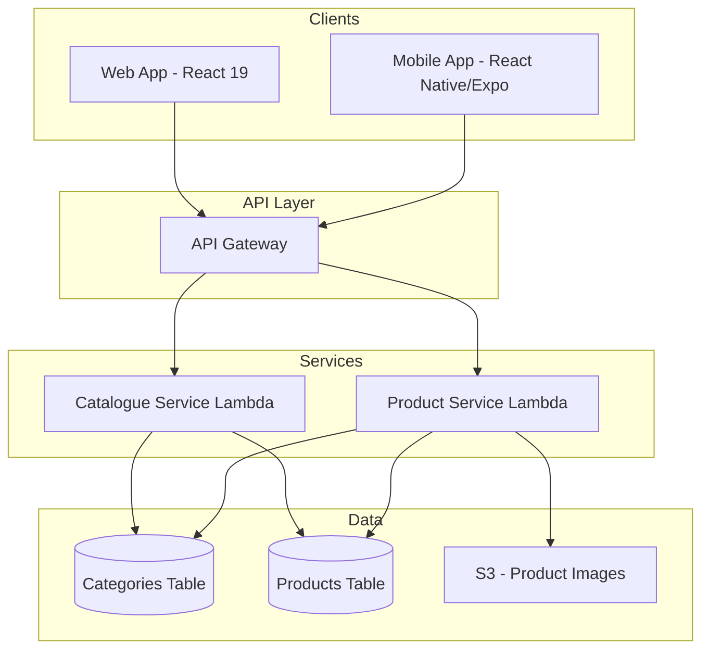
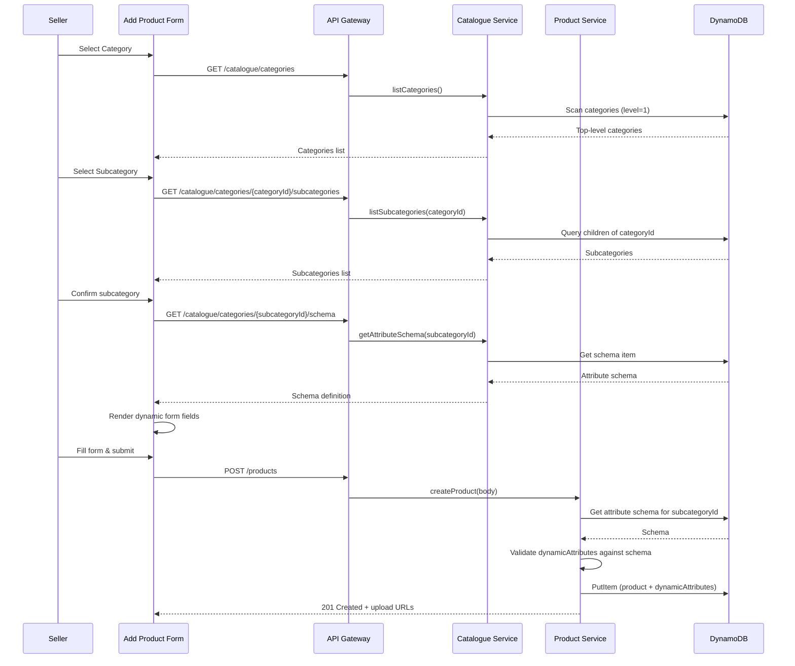
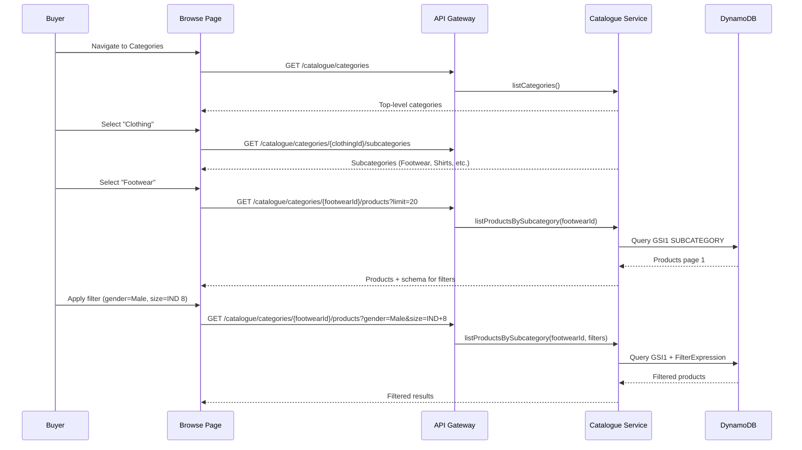

# Design Document: Category-Based Product Management

## Overview

This design introduces a hierarchical two-level category taxonomy to the BlipZo Shopping Platform, replacing the current flat `categories` string array on products with a structured system where each subcategory defines its own attribute schema. The system enables:

1. **Hierarchical browsing** — Buyers navigate Category → Subcategory → Products
2. **Dynamic product forms** — Sellers see form fields driven by the subcategory's attribute schema
3. **Category-specific filtering** — Buyers filter by attributes relevant to the subcategory they're browsing
4. **Schema-versioned attributes** — Attribute definitions can evolve without breaking existing product listings

The design leverages the existing DynamoDB single-table patterns, extends the Catalogue and Product services, and introduces a shared attribute validation layer consumed by both frontend and backend.

### Key Design Decisions

| Decision                                                                                 | Rationale                                                                                |
| ---------------------------------------------------------------------------------------- | ---------------------------------------------------------------------------------------- |
| Reuse existing `categories` table with new schema                                        | Avoids a new table; the current table has only `categoryId` + `name` and can be migrated |
| Store attribute schemas as DynamoDB items in the categories table                        | Co-locates schema with category data; avoids cross-table lookups                         |
| Use a `dynamicAttributes` map on product records                                         | DynamoDB maps support flexible key-value storage without schema migrations               |
| Validate attributes server-side using Zod schemas built from attribute definitions       | Consistent with existing validation patterns using Zod                                   |
| GSI1 partition key changes from `CATEGORY#{categoryId}` to `SUBCATEGORY#{subcategoryId}` | Enables subcategory-level product queries for browsing and filtering                     |
| Cursor-based pagination with DynamoDB `LastEvaluatedKey`                                 | Consistent with existing catalogue service pagination pattern                            |

---

## Architecture

### System Context



### Data Flow — Product Creation



### Data Flow — Buyer Browsing with Filters



---

## Components and Interfaces

### API Endpoints

#### Catalogue Service — New/Modified Endpoints

| Method | Path                                               | Auth | Description                                            |
| ------ | -------------------------------------------------- | ---- | ------------------------------------------------------ |
| GET    | `/catalogue/categories`                            | None | List all active top-level categories                   |
| GET    | `/catalogue/categories/{categoryId}/subcategories` | None | List subcategories under a category                    |
| GET    | `/catalogue/categories/{subcategoryId}/schema`     | None | Get attribute schema for a subcategory                 |
| GET    | `/catalogue/categories/{subcategoryId}/products`   | None | List products in a subcategory (paginated, filterable) |

#### Product Service — Modified Endpoints

| Method | Path                    | Auth         | Description                                                                      |
| ------ | ----------------------- | ------------ | -------------------------------------------------------------------------------- |
| POST   | `/products`             | JWT (Seller) | Create product with categoryId, subcategoryId, and dynamicAttributes             |
| PATCH  | `/products/{productId}` | JWT (Seller) | Update product including dynamicAttributes; rejects category/subcategory changes |
| GET    | `/products/{productId}` | None         | Get product detail including dynamicAttributes with display labels               |

### Request/Response Contracts

#### GET /catalogue/categories — Response

```json
{
  "categories": [
    {
      "categoryId": "cat_electronics",
      "name": "Electronics",
      "slug": "electronics",
      "icon": "electronics-icon"
    }
  ]
}
```

#### GET /catalogue/categories/{categoryId}/subcategories — Response

```json
{
  "subcategories": [
    {
      "categoryId": "subcat_phones",
      "parentId": "cat_electronics",
      "name": "Phones",
      "slug": "phones"
    }
  ]
}
```

#### GET /catalogue/categories/{subcategoryId}/schema — Response

```json
{
  "subcategoryId": "subcat_footwear",
  "schemaVersion": 1,
  "attributes": [
    {
      "fieldName": "brand",
      "displayLabel": "Brand",
      "dataType": "text",
      "required": true,
      "displayPriority": 1
    },
    {
      "fieldName": "availableSizes",
      "displayLabel": "Available Sizes",
      "dataType": "multi-select",
      "required": true,
      "allowedValues": [
        "IND 1",
        "IND 2",
        "IND 3",
        "IND 4",
        "IND 5",
        "IND 6",
        "IND 7",
        "IND 8",
        "IND 9",
        "IND 10",
        "IND 11",
        "IND 12"
      ],
      "displayPriority": 2
    },
    {
      "fieldName": "gender",
      "displayLabel": "Gender",
      "dataType": "single-select",
      "required": true,
      "allowedValues": ["Male", "Female", "Unisex"],
      "filterable": true,
      "displayPriority": 3
    }
  ]
}
```

#### POST /products — Request Body (Extended)

```json
{
  "name": "Nike Air Max",
  "description": "Comfortable running shoes",
  "price": 8999,
  "stockQuantity": 50,
  "categoryId": "cat_clothing",
  "subcategoryId": "subcat_footwear",
  "dynamicAttributes": {
    "brand": "Nike",
    "availableSizes": ["IND 7", "IND 8", "IND 9", "IND 10"],
    "gender": "Male",
    "ageGroup": "Adult",
    "availableColours": ["Black", "White"],
    "material": "Mesh",
    "soleType": "Rubber"
  },
  "images": [{ "filename": "front.jpg", "contentType": "image/jpeg", "sizeBytes": 524288 }]
}
```

#### GET /catalogue/categories/{subcategoryId}/products — Query Parameters

| Parameter            | Type   | Description                       |
| -------------------- | ------ | --------------------------------- |
| limit                | number | Page size (1-50, default 20)      |
| cursor               | string | Pagination cursor                 |
| minPrice             | number | Minimum price filter              |
| maxPrice             | number | Maximum price filter              |
| {attributeFieldName} | string | Dynamic filter by attribute value |

#### GET /catalogue/categories/{subcategoryId}/products — Response

```json
{
  "items": [
    {
      "productId": "prod_123",
      "name": "Nike Air Max",
      "price": 8999,
      "primaryImageUrl": "https://...",
      "averageRating": 4.5,
      "sellerName": "Nike Store",
      "categoryName": "Clothing",
      "subcategoryName": "Footwear",
      "previewAttributes": {
        "brand": "Nike",
        "gender": "Male",
        "availableSizes": ["IND 7", "IND 8", "IND 9"]
      }
    }
  ],
  "nextCursor": "base64...",
  "total": 142,
  "filters": {
    "gender": { "Male": 85, "Female": 42, "Unisex": 15 },
    "ageGroup": { "Adult": 120, "Kids": 22 }
  }
}
```

### Service Layer Components

#### Catalogue Service — New Modules

```
catalogue-service/src/
├── handler.ts              (extended with new routes)
├── service.ts              (extended)
├── category-tree.ts        (NEW: category/subcategory tree operations)
├── attribute-schema.ts     (NEW: schema retrieval and caching)
├── product-browse.ts       (NEW: subcategory product listing with filters)
├── validators.ts           (extended with new schemas)
└── errors.ts               (existing)
```

#### Product Service — New Modules

```
product-service/src/
├── handler.ts              (extended)
├── service.ts              (extended with dynamic attribute handling)
├── attribute-validator.ts  (NEW: validates dynamicAttributes against schema)
├── validators.ts           (extended)
└── errors.ts               (existing)
```

#### Shared Package — New Types

```
packages/shared/src/
├── types/
│   ├── category.ts         (NEW: CategoryNode, AttributeSchema, AttributeDefinition)
│   └── product.ts          (EXTENDED: add dynamicAttributes, subcategoryId, etc.)
├── schemas/
│   ├── category.schema.ts  (NEW: Zod schemas for category operations)
│   └── product.schema.ts   (EXTENDED: add dynamicAttributes validation)
```

### Frontend Components

#### Web — Seller Add Product Form

```
apps/web/src/pages/Products/
├── AddProductPage.tsx          (orchestrator)
├── components/
│   ├── CategorySelector.tsx    (step 1: category + subcategory selection)
│   ├── DynamicAttributeForm.tsx (step 2: renders fields from schema)
│   ├── CommonFieldsForm.tsx    (step 3: name, description, price, stock, images)
│   └── FormFieldRenderer.tsx   (renders individual field by dataType)
```

#### Web — Buyer Browse

```
apps/web/src/pages/Browse/
├── CategoriesPage.tsx          (top-level category grid)
├── SubcategoriesPage.tsx       (subcategory list under a category)
├── SubcategoryProductsPage.tsx (product grid with dynamic filters)
├── components/
│   ├── CategoryCard.tsx
│   ├── SubcategoryCard.tsx
│   ├── DynamicFilterPanel.tsx  (renders filter controls from schema)
│   ├── FilterChip.tsx
│   └── Breadcrumb.tsx
```

#### Mobile — Equivalent Screens

The mobile app mirrors the web structure using React Native components with NativeWind styling. Navigation uses React Navigation stack/tab navigators.

---

## Data Models

### Categories Table — Redesigned Schema

The existing `categories` table (PK: `categoryId`) is redesigned to support hierarchical nodes and attribute schemas using a single-table pattern.

#### Table Key Schema

| Attribute | Type   | Description                                 |
| --------- | ------ | ------------------------------------------- |
| PK        | String | Partition key: `CAT#{categoryId}`           |
| SK        | String | Sort key: `METADATA` or `SCHEMA#v{version}` |

#### GSI: ParentIndex

| Attribute | Type   | Description                                        |
| --------- | ------ | -------------------------------------------------- |
| GSI1PK    | String | `PARENT#{parentId}` or `PARENT#ROOT` for top-level |
| GSI1SK    | String | `NAME#{name}` for alphabetical sorting             |

#### Category Node Item (SK = "METADATA")

```json
{
  "PK": "CAT#subcat_footwear",
  "SK": "METADATA",
  "categoryId": "subcat_footwear",
  "parentId": "cat_clothing",
  "name": "Footwear",
  "slug": "footwear",
  "level": 2,
  "isActive": true,
  "icon": "footwear-icon",
  "createdAt": "2024-01-01T00:00:00.000Z",
  "updatedAt": "2024-01-01T00:00:00.000Z",
  "GSI1PK": "PARENT#cat_clothing",
  "GSI1SK": "NAME#Footwear"
}
```

#### Top-Level Category Item

```json
{
  "PK": "CAT#cat_clothing",
  "SK": "METADATA",
  "categoryId": "cat_clothing",
  "parentId": null,
  "name": "Clothing",
  "slug": "clothing",
  "level": 1,
  "isActive": true,
  "icon": "clothing-icon",
  "createdAt": "2024-01-01T00:00:00.000Z",
  "updatedAt": "2024-01-01T00:00:00.000Z",
  "GSI1PK": "PARENT#ROOT",
  "GSI1SK": "NAME#Clothing"
}
```

#### Attribute Schema Item (SK = "SCHEMA#v{version}")

```json
{
  "PK": "CAT#subcat_footwear",
  "SK": "SCHEMA#v1",
  "subcategoryId": "subcat_footwear",
  "schemaVersion": 1,
  "attributes": [
    {
      "fieldName": "brand",
      "displayLabel": "Brand",
      "dataType": "text",
      "required": true,
      "filterable": true,
      "displayPriority": 1
    },
    {
      "fieldName": "availableSizes",
      "displayLabel": "Available Sizes",
      "dataType": "multi-select",
      "required": true,
      "allowedValues": [
        "IND 1",
        "IND 2",
        "IND 3",
        "IND 4",
        "IND 5",
        "IND 6",
        "IND 7",
        "IND 8",
        "IND 9",
        "IND 10",
        "IND 11",
        "IND 12"
      ],
      "filterable": true,
      "displayPriority": 2
    },
    {
      "fieldName": "gender",
      "displayLabel": "Gender",
      "dataType": "single-select",
      "required": true,
      "allowedValues": ["Male", "Female", "Unisex"],
      "filterable": true,
      "displayPriority": 3
    },
    {
      "fieldName": "ageGroup",
      "displayLabel": "Age Group",
      "dataType": "single-select",
      "required": true,
      "allowedValues": ["Adult", "Kids"],
      "filterable": true,
      "displayPriority": 4
    },
    {
      "fieldName": "availableColours",
      "displayLabel": "Available Colours",
      "dataType": "multi-select",
      "required": true,
      "allowedValues": null,
      "filterable": true,
      "displayPriority": 5
    },
    {
      "fieldName": "material",
      "displayLabel": "Material",
      "dataType": "text",
      "required": false,
      "filterable": false,
      "displayPriority": 6
    },
    {
      "fieldName": "soleType",
      "displayLabel": "Sole Type",
      "dataType": "text",
      "required": false,
      "filterable": false,
      "displayPriority": 7
    }
  ],
  "createdAt": "2024-01-01T00:00:00.000Z"
}
```

### Products Table — Extended Schema

The existing products table is extended with new attributes. The GSI1 partition key changes from `CATEGORY#{categoryId}` to `SUBCATEGORY#{subcategoryId}`.

#### Extended Product Item

```json
{
  "PK": "PRODUCT#prod_123",
  "SK": "METADATA",
  "productId": "prod_123",
  "sellerId": "seller_456",
  "name": "Nike Air Max",
  "description": "Comfortable running shoes",
  "price": 8999,
  "stockQuantity": 50,
  "categoryId": "cat_clothing",
  "subcategoryId": "subcat_footwear",
  "dynamicAttributes": {
    "brand": "Nike",
    "availableSizes": ["IND 7", "IND 8", "IND 9", "IND 10"],
    "gender": "Male",
    "ageGroup": "Adult",
    "availableColours": ["Black", "White"],
    "material": "Mesh",
    "soleType": "Rubber"
  },
  "schemaVersion": 1,
  "imageUrls": ["https://..."],
  "isDeleted": false,
  "createdAt": "2024-06-15T10:30:00.000Z",
  "updatedAt": "2024-06-15T10:30:00.000Z",
  "searchTokens": "nike air max comfortable running shoes nike male",
  "GSI1PK": "SUBCATEGORY#subcat_footwear",
  "GSI1SK": "CREATED#2024-06-15T10:30:00.000Z",
  "GSI2PK": "SELLER#seller_456",
  "GSI2SK": "CREATED#2024-06-15T10:30:00.000Z"
}
```

#### Migration Notes

- Existing products retain their `categories: string[]` field for backward compatibility
- New products use `categoryId`, `subcategoryId`, and `dynamicAttributes`
- The `GSI1PK` changes from `CATEGORY#` prefix to `SUBCATEGORY#` prefix for new products
- A migration script will backfill existing products with appropriate subcategoryId mappings

### TypeScript Interfaces

```typescript
// packages/shared/src/types/category.ts

export interface CategoryNode {
  categoryId: string;
  parentId: string | null;
  name: string;
  slug: string;
  level: 1 | 2;
  isActive: boolean;
  icon?: string;
  createdAt: string;
  updatedAt: string;
}

export type AttributeDataType = 'text' | 'number' | 'single-select' | 'multi-select' | 'boolean';

export interface AttributeDefinition {
  fieldName: string;
  displayLabel: string;
  dataType: AttributeDataType;
  required: boolean;
  allowedValues?: string[] | null;
  filterable: boolean;
  displayPriority: number;
}

export interface AttributeSchema {
  subcategoryId: string;
  schemaVersion: number;
  attributes: AttributeDefinition[];
  createdAt: string;
}

export interface CategoryTreeResponse {
  categories: CategoryNode[];
}

export interface SubcategoryListResponse {
  subcategories: CategoryNode[];
}

export interface AttributeSchemaResponse {
  subcategoryId: string;
  schemaVersion: number;
  attributes: AttributeDefinition[];
}
```

```typescript
// Extended ProductRecord (packages/shared/src/types/product.ts)

export interface ProductRecord {
  productId: string;
  sellerId: string;
  name: string;
  description: string;
  price: number;
  stockQuantity: number;
  categoryId: string;
  subcategoryId: string;
  dynamicAttributes: Record<string, string | number | boolean | string[]>;
  schemaVersion: number;
  imageUrls: string[];
  isDeleted: boolean;
  createdAt: string;
  updatedAt: string;
  sellerPolicy?: SellerPolicy;
  // Legacy field — retained for backward compatibility
  categories?: string[];
}
```

### Data Seeding Strategy

The initial category tree and attribute schemas are seeded via a CDK custom resource or a standalone seeding script run during deployment.

#### Seed Data Structure

```typescript
// infra/cdk/seed/category-seed-data.ts

export const CATEGORY_SEED_DATA = {
  categories: [
    { categoryId: 'cat_electronics', name: 'Electronics', slug: 'electronics', icon: 'cpu' },
    { categoryId: 'cat_clothing', name: 'Clothing', slug: 'clothing', icon: 'shirt' },
    { categoryId: 'cat_home_kitchen', name: 'Home & Kitchen', slug: 'home-kitchen', icon: 'home' },
    { categoryId: 'cat_books', name: 'Books', slug: 'books', icon: 'book' },
    {
      categoryId: 'cat_sports',
      name: 'Sports & Outdoors',
      slug: 'sports-outdoors',
      icon: 'dumbbell',
    },
  ],
  subcategories: [
    // Electronics
    { categoryId: 'subcat_phones', parentId: 'cat_electronics', name: 'Phones', slug: 'phones' },
    { categoryId: 'subcat_laptops', parentId: 'cat_electronics', name: 'Laptops', slug: 'laptops' },
    {
      categoryId: 'subcat_accessories_elec',
      parentId: 'cat_electronics',
      name: 'Accessories',
      slug: 'accessories-electronics',
    },
    // Clothing
    { categoryId: 'subcat_footwear', parentId: 'cat_clothing', name: 'Footwear', slug: 'footwear' },
    { categoryId: 'subcat_shirts', parentId: 'cat_clothing', name: 'Shirts', slug: 'shirts' },
    { categoryId: 'subcat_pants', parentId: 'cat_clothing', name: 'Pants', slug: 'pants' },
    { categoryId: 'subcat_dresses', parentId: 'cat_clothing', name: 'Dresses', slug: 'dresses' },
    // Home & Kitchen
    {
      categoryId: 'subcat_furniture',
      parentId: 'cat_home_kitchen',
      name: 'Furniture',
      slug: 'furniture',
    },
    {
      categoryId: 'subcat_appliances',
      parentId: 'cat_home_kitchen',
      name: 'Appliances',
      slug: 'appliances',
    },
    { categoryId: 'subcat_decor', parentId: 'cat_home_kitchen', name: 'Decor', slug: 'decor' },
    // Books
    { categoryId: 'subcat_fiction', parentId: 'cat_books', name: 'Fiction', slug: 'fiction' },
    {
      categoryId: 'subcat_nonfiction',
      parentId: 'cat_books',
      name: 'Non-Fiction',
      slug: 'non-fiction',
    },
    { categoryId: 'subcat_academic', parentId: 'cat_books', name: 'Academic', slug: 'academic' },
    // Sports & Outdoors
    {
      categoryId: 'subcat_equipment',
      parentId: 'cat_sports',
      name: 'Equipment',
      slug: 'equipment',
    },
    {
      categoryId: 'subcat_clothing_sports',
      parentId: 'cat_sports',
      name: 'Clothing',
      slug: 'clothing-sports',
    },
    {
      categoryId: 'subcat_accessories_sports',
      parentId: 'cat_sports',
      name: 'Accessories',
      slug: 'accessories-sports',
    },
  ],
};
```

#### Seeding Approach

1. **CDK Custom Resource Lambda** — Runs on `CREATE` and `UPDATE` events during `cdk deploy`
2. Writes category nodes as `PK=CAT#{id}, SK=METADATA` items
3. Writes attribute schemas as `PK=CAT#{subcategoryId}, SK=SCHEMA#v1` items
4. Uses `PutItem` with `ConditionExpression: attribute_not_exists(PK)` to avoid overwriting existing data
5. Idempotent — safe to re-run on subsequent deployments

---

## Correctness Properties

_A property is a characteristic or behavior that should hold true across all valid executions of a system — essentially, a formal statement about what the system should do. Properties serve as the bridge between human-readable specifications and machine-verifiable correctness guarantees._

### Property 1: Parent-child relationship integrity

_For any_ category node at level 2 (subcategory), querying subcategories by its parentId should return that node in the results, and querying subcategories by any other parentId should NOT return that node.

**Validates: Requirements 1.3, 5.2**

### Property 2: Category node structural completeness

_For any_ category node in the system, it must have a non-empty categoryId, a non-empty name, a non-empty slug, a level of exactly 1 or 2, an isActive boolean, and parentId must be null if and only if level is 1.

**Validates: Requirements 1.6**

### Property 3: Attribute schema structural validity

_For any_ attribute definition within any subcategory's attribute schema, it must have a non-empty fieldName, a non-empty displayLabel, a valid dataType (text|number|single-select|multi-select|boolean), a boolean required flag, and when dataType is single-select or multi-select, allowedValues must be a non-empty array if specified.

**Validates: Requirements 2.1, 2.2**

### Property 4: Schema versioning preserves existing products

_For any_ product created with schema version N, the product should remain retrievable and its stored dynamicAttributes should remain intact regardless of the current schema version being N+M.

**Validates: Requirements 2.8**

### Property 5: Form field rendering matches schema data types

_For any_ attribute definition with a given dataType, the form field renderer should produce the correct control type: text→text input, number→number input, single-select→dropdown, multi-select→multi-select control, boolean→toggle switch.

**Validates: Requirements 3.3, 3.4**

### Property 6: Valid dynamic attributes are accepted

_For any_ valid attribute schema and any set of dynamic attributes where all required fields are present, all values match their declared dataType, and all select-field values are within allowedValues, the attribute validator should accept the submission without errors.

**Validates: Requirements 3.5, 3.6, 7.4, 8.4**

### Property 7: Invalid dynamic attributes produce field-level errors

_For any_ attribute schema and any set of dynamic attributes that violates at least one constraint (missing required field, wrong type, value not in allowedValues), the attribute validator should reject the submission and return an error message identifying the specific violating field.

**Validates: Requirements 3.5, 3.7, 7.4**

### Property 8: Product creation round-trip preserves dynamic attributes

_For any_ valid product creation input with categoryId, subcategoryId, and dynamicAttributes, after successful creation, reading the product back should return the exact same categoryId, subcategoryId, and dynamicAttributes values that were submitted.

**Validates: Requirements 3.8, 7.1, 7.2**

### Property 9: Product detail rendering uses display labels and omits empty optionals

_For any_ product with dynamic attributes, the rendered specifications section should use the displayLabel (not fieldName) from the attribute schema for each attribute, and should omit any optional attribute whose value is undefined or null.

**Validates: Requirements 4.4, 4.6**

### Property 10: Only active categories are returned in browsing

_For any_ set of category nodes where some have isActive=true and others have isActive=false, the list categories endpoint should return only nodes where isActive=true.

**Validates: Requirements 5.1**

### Property 11: Subcategory products are sorted by creation date descending

_For any_ subcategory containing multiple products, the paginated product list should return items where each item's createdAt timestamp is greater than or equal to the next item's createdAt timestamp.

**Validates: Requirements 5.3**

### Property 12: Soft-deleted products are excluded from all browsing results

_For any_ subcategory browsing query or search query, no product in the returned result set should have isDeleted=true.

**Validates: Requirements 5.6**

### Property 13: Filter correctness — all results satisfy all applied filters

_For any_ combination of attribute filters (single-select equality, multi-select contains, price range), every product in the result set must satisfy ALL applied filter conditions simultaneously. Specifically: for single-select filters, product's attribute value must equal the filter value; for multi-select filters, product's attribute array must contain the filter value; for price range, product's price must be within [min, max].

**Validates: Requirements 6.2, 6.3, 6.4, 6.5**

### Property 14: Filterable attributes match schema definition

_For any_ subcategory, the set of filter options presented to the buyer should exactly match the set of attributes marked as filterable=true in that subcategory's attribute schema.

**Validates: Requirements 6.1**

### Property 15: Category and subcategory are immutable after product creation

_For any_ existing product, an update request that attempts to change the categoryId or subcategoryId should be rejected with a 400 error, and the product's categoryId and subcategoryId should remain unchanged.

**Validates: Requirements 8.3**

### Property 16: Search tokens include dynamic attribute text values

_For any_ product with text-type dynamic attributes (brand, model, author), the generated searchTokens string should contain the lowercase values of those attributes in addition to the product name and description.

**Validates: Requirements 9.4**

### Property 17: Search results include category context and preview attributes

_For any_ product appearing in search results, the result item must include non-empty categoryName and subcategoryName fields, and previewAttributes should contain at most 3 attributes selected by lowest displayPriority from the schema.

**Validates: Requirements 9.1, 9.2**

---

## Error Handling

### Catalogue Service Errors

| Scenario                         | HTTP Status | Error Code            | Message                                              |
| -------------------------------- | ----------- | --------------------- | ---------------------------------------------------- |
| Category not found               | 404         | CATEGORY_NOT_FOUND    | Category '{id}' not found                            |
| Subcategory not found            | 404         | SUBCATEGORY_NOT_FOUND | Subcategory '{id}' not found                         |
| Schema not found for subcategory | 404         | SCHEMA_NOT_FOUND      | Attribute schema not found for subcategory '{id}'    |
| Invalid pagination cursor        | 400         | INVALID_CURSOR        | Invalid pagination cursor                            |
| Invalid filter parameter         | 400         | INVALID_FILTER        | Filter '{field}' is not a valid filterable attribute |
| DynamoDB service error           | 503         | SERVICE_UNAVAILABLE   | Service temporarily unavailable                      |

### Product Service Errors

| Scenario                               | HTTP Status | Error Code           | Message                                                   |
| -------------------------------------- | ----------- | -------------------- | --------------------------------------------------------- |
| Invalid subcategory on creation        | 400         | INVALID_SUBCATEGORY  | Subcategory '{id}' does not exist                         |
| Dynamic attribute validation failure   | 400         | VALIDATION_FAILED    | Validation failed (with field-level errors)               |
| Attempt to change category/subcategory | 400         | CATEGORY_IMMUTABLE   | Category and subcategory cannot be changed after creation |
| Schema not found during validation     | 500         | SCHEMA_LOOKUP_FAILED | Failed to retrieve attribute schema                       |
| Product not found                      | 404         | PRODUCT_NOT_FOUND    | Product '{id}' not found                                  |
| Unauthorized (not product owner)       | 403         | FORBIDDEN            | You do not have permission to modify this product         |

### Error Response Format

Consistent with existing platform error format:

```json
{
  "statusCode": 400,
  "error": "VALIDATION_FAILED",
  "message": "Validation failed",
  "fields": {
    "dynamicAttributes.brand": "Brand is required",
    "dynamicAttributes.availableSizes": "At least one size must be selected",
    "dynamicAttributes.gender": "Value 'Other' is not allowed. Allowed values: Male, Female, Unisex"
  }
}
```

### Retry and Resilience

- DynamoDB transient errors (throttling, 5xx) are retried by the AWS SDK with exponential backoff
- Schema lookups are cached in-memory within a Lambda invocation (schemas change infrequently)
- The catalogue service uses eventually-consistent reads for browsing (acceptable for product listings)
- Product creation uses strongly-consistent reads for schema validation (ensures latest schema)

---

## Testing Strategy

### Property-Based Testing

This feature is well-suited for property-based testing due to:

- The attribute validation logic operates on arbitrary schemas and attribute sets (large input space)
- Filtering logic must hold across all possible filter combinations
- Round-trip properties for product creation/retrieval
- Structural invariants on category tree and schema definitions

**Library:** [fast-check](https://github.com/dubzzz/fast-check) (TypeScript PBT library, compatible with Vitest)

**Configuration:**

- Minimum 100 iterations per property test
- Each test tagged with: `Feature: category-based-product-management, Property {N}: {description}`

**Property tests to implement:**

- Property 2: Category node structural completeness
- Property 3: Attribute schema structural validity
- Property 5: Form field rendering matches schema data types
- Property 6: Valid dynamic attributes are accepted
- Property 7: Invalid dynamic attributes produce field-level errors
- Property 8: Product creation round-trip preserves dynamic attributes
- Property 11: Subcategory products sorted by creation date descending
- Property 12: Soft-deleted products excluded from results
- Property 13: Filter correctness (all results satisfy all filters)
- Property 15: Category/subcategory immutable after creation
- Property 16: Search tokens include dynamic attribute values

### Unit Tests (Example-Based)

| Area                    | Test Cases                                                                   |
| ----------------------- | ---------------------------------------------------------------------------- |
| Attribute validator     | Specific schema examples (Footwear, Phones, Books) with valid/invalid inputs |
| Category tree queries   | Verify seed data returns expected categories and subcategories               |
| Form field renderer     | Render each data type and verify correct HTML element                        |
| Product detail renderer | Verify specifications section for known product types                        |
| Search token generation | Verify tokens include brand, model, author for specific products             |
| Price range filter      | Boundary cases: min=max, min=0, max=very large                               |
| Pagination              | First page, last page, empty results                                         |

### Integration Tests

| Area                                     | Test Cases                                                                 |
| ---------------------------------------- | -------------------------------------------------------------------------- |
| DynamoDB category queries                | GSI1 parent-child queries return correct results                           |
| Product creation end-to-end              | Create product with dynamic attributes, verify stored correctly            |
| Product update with schema validation    | Update attributes, verify validation runs against current schema           |
| Subcategory product listing with filters | Apply filters via API, verify DynamoDB FilterExpression works              |
| Schema versioning                        | Create product with v1, update schema to v2, verify product still readable |
| Seed data deployment                     | Verify CDK custom resource seeds all categories and schemas                |

### E2E Tests (Playwright / Detox)

| Flow                      | Steps                                                                                                    |
| ------------------------- | -------------------------------------------------------------------------------------------------------- |
| Seller creates product    | Login → Select category → Select subcategory → Fill dynamic form → Submit → Verify product exists        |
| Buyer browses by category | Navigate categories → Select subcategory → Verify products load → Apply filter → Verify filtered results |
| Seller updates product    | Login → Edit product → Modify dynamic attributes → Submit → Verify changes persisted                     |

### Test File Organization

```
services/catalogue-service/src/
├── category-tree.test.ts           (unit + property tests for tree operations)
├── attribute-schema.test.ts        (unit tests for schema retrieval)
├── product-browse.test.ts          (unit + property tests for browsing/filtering)
├── attribute-validator.property.test.ts  (property tests for validation logic)

services/product-service/src/
├── dynamic-attributes.test.ts      (unit tests for attribute storage)
├── dynamic-attributes.property.test.ts  (property tests for validation)
├── search-tokens.test.ts           (unit + property tests for token generation)

packages/shared/src/
├── schemas/category.schema.test.ts (unit tests for Zod schemas)

apps/web/src/pages/Products/
├── components/FormFieldRenderer.test.tsx  (property + unit tests)
├── components/DynamicAttributeForm.test.tsx (unit tests)

apps/web/src/pages/Browse/
├── components/DynamicFilterPanel.test.tsx  (unit tests)
```
